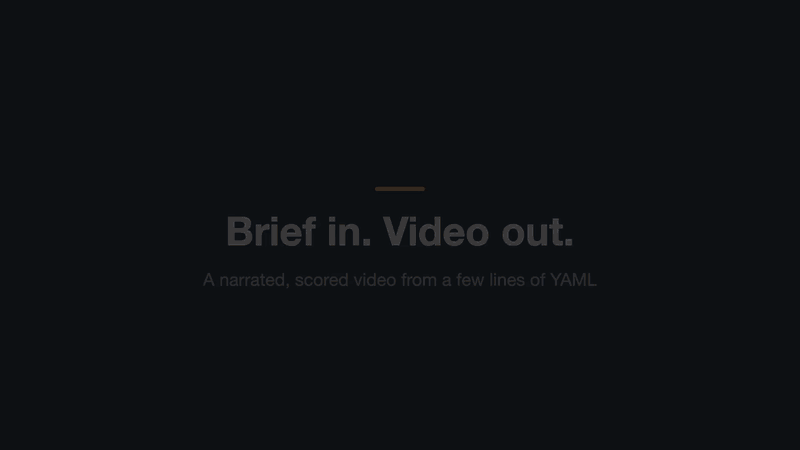

# ReelHive

> Brief in, video out. A local-first tool that turns a short brief into a narrated, scored video, using a Strands Graph of agents, Kokoro TTS and Revideo.

[](https://github.com/d2k-klin/reelhive/actions/workflows/ci.yml)
[](LICENSE)
[](pyproject.toml)
[](#privacy)



*Made with ReelHive from [assets/demo/brief.yaml](assets/demo/brief.yaml). With sound: [demo.mp4](assets/demo/demo.mp4).*

## Quickstart

Requirements: Python 3.11-3.12, Node 20+ and [uv](https://docs.astral.sh/uv/). ffmpeg and espeak-ng are used from your system when installed, and otherwise come bundled with the Python dependencies.

```bash
git clone https://github.com/d2k-klin/reelhive && cd reelhive
make setup                                        # Python + Node deps, browsers for capture and rendering
export ANTHROPIC_API_KEY=...                      # or configure another provider, see below
uv run reelhive doctor                            # checks every dependency and key
uv run reelhive run examples/briefs/small.yaml
```

The video lands in `runs/<timestamp>_<slug>/video.mp4`, next to the script, the scene spec, the audio and a `run.log.jsonl` of every step. Cloning is the install method: the Node renderer lives next to the Python package, so nothing is published to PyPI or npm.

## How it works

Two Strands graphs. The draft graph writes the script; the production graph turns it into a video:

```
brief ─► script                       (draft graph)

    ┌─► scenes ─► visuals ─┐
    ├─► narrate ┼─► timing ─► critic ─┬─(pass)──────────────────────► render
    └─► music ──┘                     └─(fail)─► fix ─► recheck ─(pass)─┘
```

| Node | Type | Job |
| --- | --- | --- |
| `brief` | deterministic | Validate the brief and fill the level's defaults |
| `script` | agent (strong) | Narration split into beats, sized to the target duration |
| `scenes` | agent (fast) | A template and on-screen text per beat |
| `visuals` | deterministic | Provided images, masked screenshots or concept generation, with text fallbacks |
| `narrate` | deterministic | Kokoro TTS per beat, with real durations |
| `music` | agent (fast) + lookup | Mood and tempo, then a track from the CC0 library |
| `timing` | deterministic | Scene lengths from the real audio |
| `critic` | hard checks + agent | Duration, pace, closing message, feature coverage, text limits; then a rubric review |
| `fix` / `recheck` | agent / deterministic | Repair the spec, re-voice what changed, check again or stop with a report |
| `render` | deterministic | Revideo renders the frames; ffmpeg mixes, ducks the music under the voice and muxes |

See [docs/architecture.md](docs/architecture.md) for the full picture, and [docs/strands-graph.md](docs/strands-graph.md) for what building it taught us about Strands graphs.

## Customization levels

| Level | You provide | Stops for approval | Example |
| --- | --- | --- | --- |
| `small` | audience, storyline, features, duration, format, closing, voice gender; optionally a visual source | none | [small.yaml](examples/briefs/small.yaml), [small-screenshots.yaml](examples/briefs/small-screenshots.yaml) |
| `medium` | + tone, pacing, brand colors and logo, theme, music mood, CTA URL, accent and speed, full `visuals` block | script | [medium.yaml](examples/briefs/medium.yaml) |
| `high` | + per-scene spec, images and music (M3) | script, scenes, images | coming in M3 |

```bash
uv run reelhive run examples/briefs/medium.yaml
# edit runs/<run-folder>/script.json if you like, then:
uv run reelhive approve runs/<run-folder>
```

Every field is in [docs/brief-reference.md](docs/brief-reference.md).

## Visuals

Each scene asks for one of three kinds of visual, and ReelHive fills it from your sources in this order:

| Scene kind | Sources, in order |
| --- | --- |
| Product UI | your image → a screenshot of your app → text only |
| Concept | your image → a generated illustration → text only |
| None | typography only |

- **Screenshots** of your running app with Playwright: `reelhive login <url>` saves a session after you sign in by hand (ReelHive never sees passwords), `mask` selectors black out emails and keys, and `reelhive capture` previews the shots before you make a video.
- **Your images**, matched by filename and caption; they stay on your machine unless you opt in to `describe_images`.
- **Generated images** (OpenAI) for concept scenes only, with a per-run cap and cache. Generated images are never used for product UI.

Details: [docs/visuals.md](docs/visuals.md).

## Voices and formats

| | US | UK |
| --- | --- | --- |
| female | `af_heart` (default) | `bf_emma` |
| male | `am_michael` | `bm_george` |

Kokoro runs locally on CPU, Apple Silicon or CUDA, at speeds from 0.8 to 1.2. Formats: `16:9` (1920×1080), `9:16` (1080×1920) and `1:1` (1080×1080). Templates are listed in [docs/templates.md](docs/templates.md).

## Providers

| Provider | Install | Auth |
| --- | --- | --- |
| Claude (default) | built in | `ANTHROPIC_API_KEY` |
| Amazon Bedrock | built in | AWS profile or IAM role |
| OpenAI | `uv sync --extra openai` | `OPENAI_API_KEY` |
| Ollama | `uv sync --extra ollama` | none (local) |
| GitHub Copilot | `uv sync --extra copilot` | Copilot sign-in, `GH_TOKEN` or `COPILOT_GITHUB_TOKEN` |

```yaml
# config.yaml
provider: claude
nodes: {script: copilot}            # optional per-node overrides
models:
  claude: {strong: claude-sonnet-5-5, fast: claude-haiku-5-5}
  copilot: {strong: YOUR_COPILOT_MODEL, fast: YOUR_COPILOT_MODEL}
```

Copilot sessions are locked down to a single submit tool; shell and file-write requests are refused. See [docs/providers.md](docs/providers.md) and [docs/copilot-sdk.md](docs/copilot-sdk.md).

## Privacy

| Data | Leaves your machine? |
| --- | --- |
| Brief text, script, image filenames and captions, page titles | Yes, to your agent provider (Claude, Bedrock, OpenAI or GitHub Copilot); no, with Ollama |
| Screenshots | No |
| Your images | No, unless `describe_images: true` |
| Image prompts | Yes, to OpenAI, only when `generate` is on |
| Audio, video, login state | No |

## Credit

Every video ends with a short **Made with ReelHive by Mr.D** card (`credit: end`), or carries a small corner badge (`credit: corner`). To turn the visible credit off:

```bash
REELHIVE_DISABLE_CREDIT=true uv run reelhive run brief.yaml
```

An invisible MP4 metadata tag is always written.

## Quick actions

`reelhive suggest runs/<run> --beat 2` (or `--scene 3`) offers 3-4 specific edits for that beat or scene, such as "Punchier hook" or "Shorten by ~2s". In the local UI they will appear as buttons rendered with CopilotKit. See [docs/copilotkit.md](docs/copilotkit.md).

## Evals

`reelhive eval --providers claude,bedrock --set core` scores scripts, scene specs and image prompts across providers on a 24-brief dataset, without rendering video or paying for images, and writes a comparison report. Prompt changes are gated in CI against a baseline. See [evals/README.md](evals/README.md).

## Contributing

```bash
make test        # pytest with fakes (no API keys, no network) + renderer vitest
make test-slow   # real Kokoro + real Revideo render
make lint        # ruff, mypy, tsc
```

See [CONTRIBUTING.md](CONTRIBUTING.md), [SECURITY.md](SECURITY.md) and the [plan](docs/plan.md).

## License and credits

Code: [Apache-2.0](LICENSE). The Mr.D name and artwork are not covered by the code license. The placeholder music in `assets/music` is generated by `scripts/make_music.py` and dedicated to the public domain (CC0-1.0).

Built on [Strands Agents](https://strandsagents.com), [Kokoro](https://huggingface.co/hexgrad/Kokoro-82M), [Revideo](https://re.video), [Playwright](https://playwright.dev), [ffmpeg](https://ffmpeg.org) and the [GitHub Copilot SDK](https://github.com/github/copilot-sdk).
