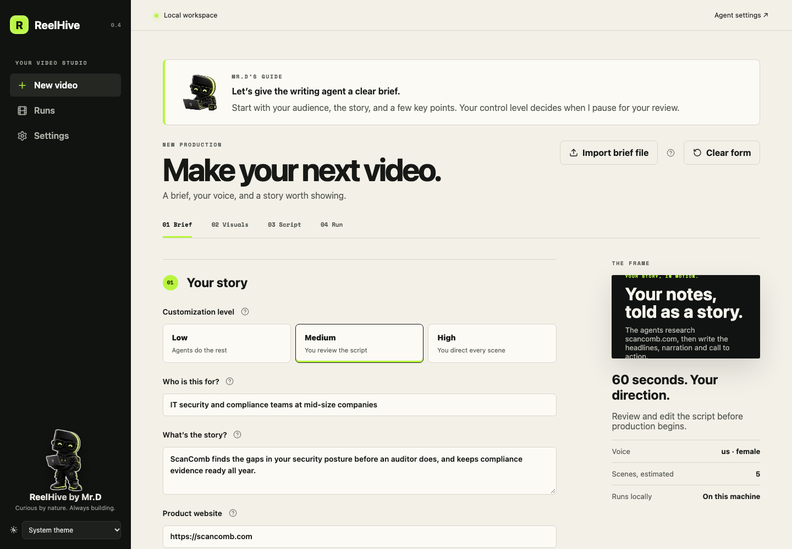
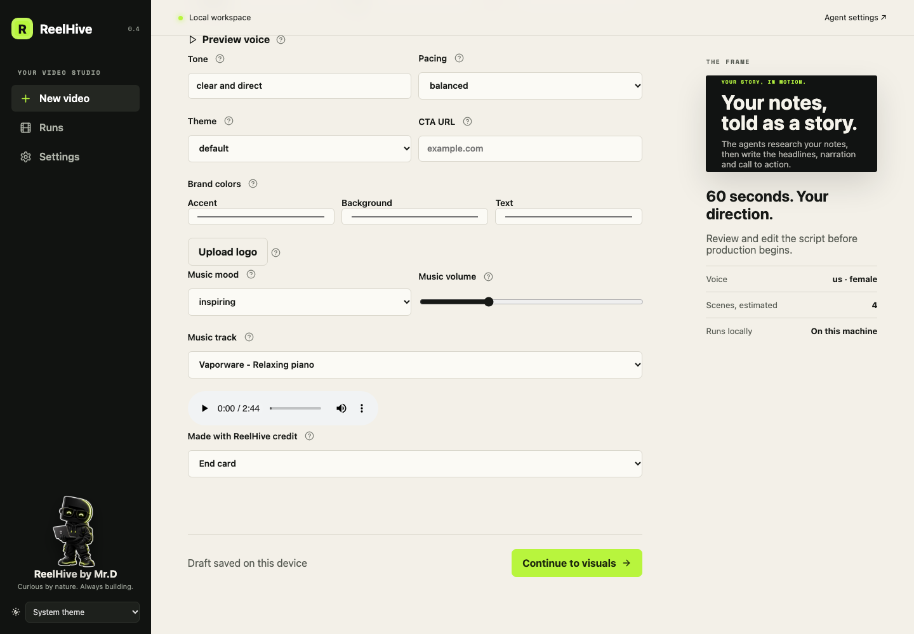
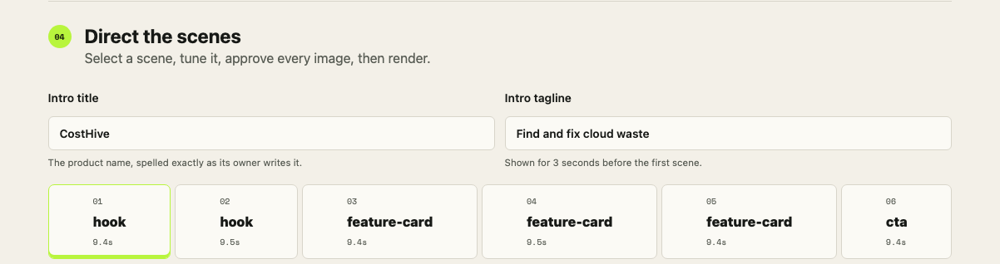
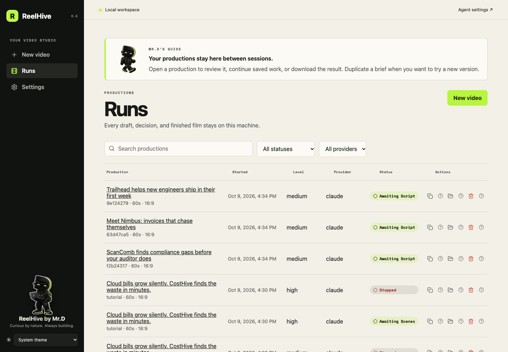
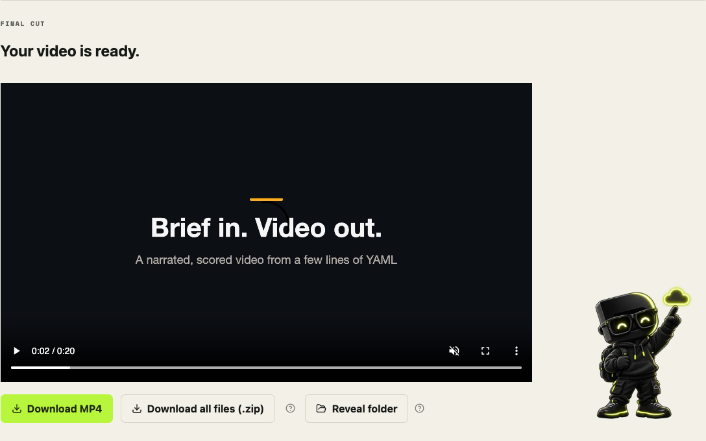

# The studio

`uv run reelhive ui` opens the studio in your browser. It runs only on your machine, on `127.0.0.1`.

## Write the brief

Pick a customization level, then describe who the video is for, the story, your website, a few key points and the closing idea. [Every field](brief-reference.md) can also be set from a YAML file.



## Make it yours

Set duration, format, voice, tone, theme and brand colors, then choose the background music: a mood, or one of the bundled instrumentals, with a preview before you commit.



## Direct the scenes

Every video opens with a 3-second intro screen: the product name, a one-line tagline and your site address in small letters. At the high level you can edit it, and every scene, before anything is rendered.



## Keep every production

The Runs screen lists productions newest first with their start time. Open one to review it, download the video, or choose **Edit brief and make a new video** to change a brief and start a new run.



## Download the result



## Quick actions

On the Script and Scenes screens, the selected beat or scene gets 3-4 suggested edits as buttons, such as "Punchier hook" or "Shorten by ~2s", rendered with CopilotKit from an AG-UI tool call. One click regenerates just that beat or scene; **Undo** puts it back. The same works from the terminal:

```bash
uv run reelhive suggest runs/<run> --scene 3            # list them
uv run reelhive suggest runs/<run> --scene 3 --apply 2  # apply the second
uv run reelhive undo runs/<run> --scene 3
```

See [docs/copilotkit.md](copilotkit.md).

For the full screen-by-screen walkthrough, see the [UI user guide](ui-guide.md).
