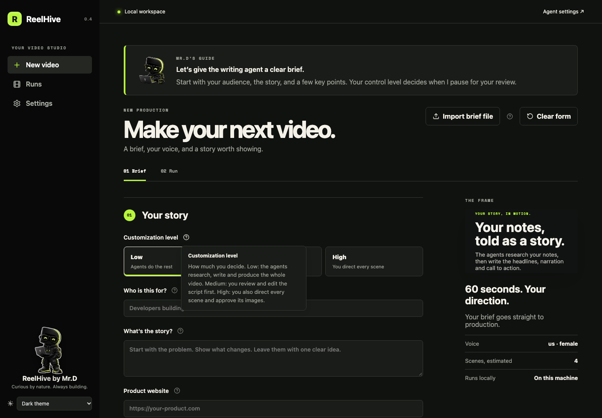
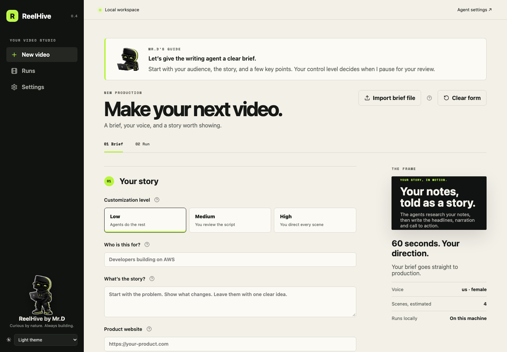
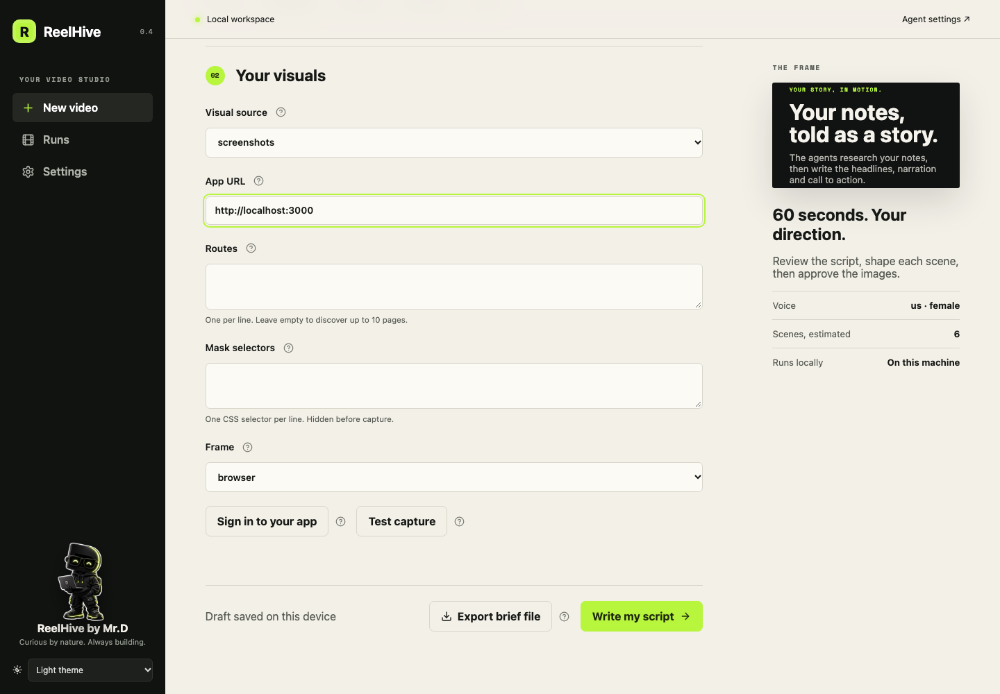
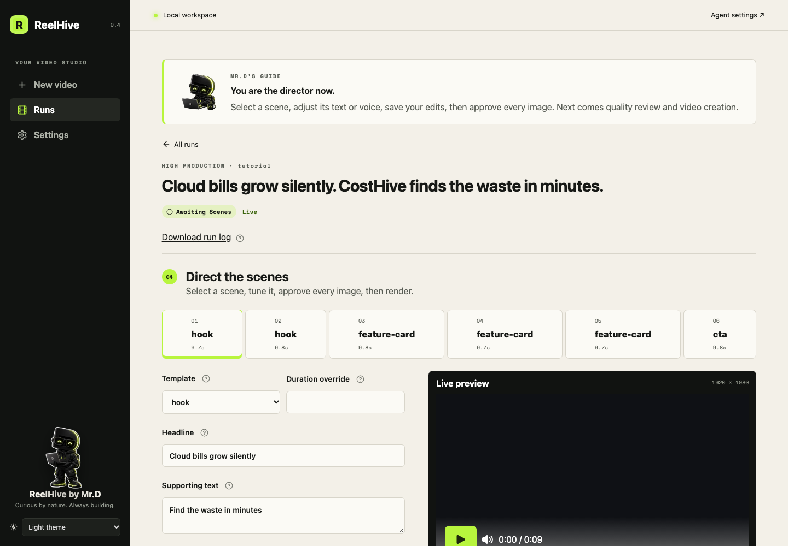
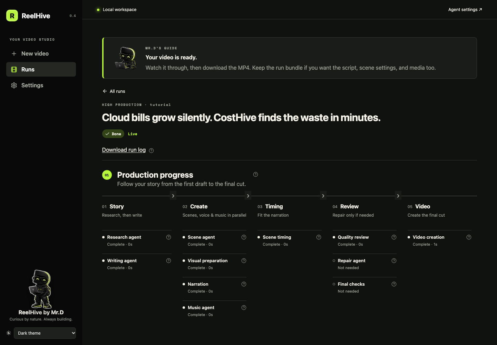
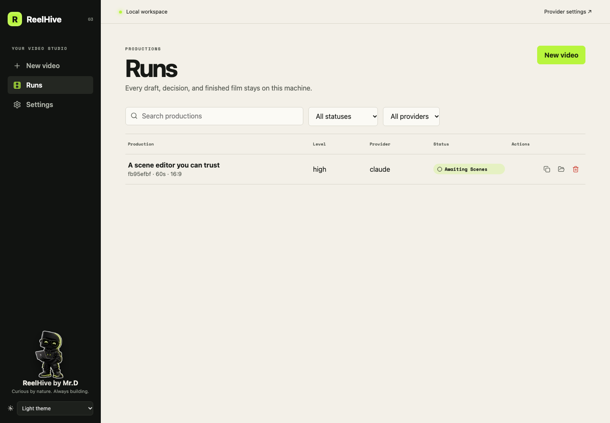
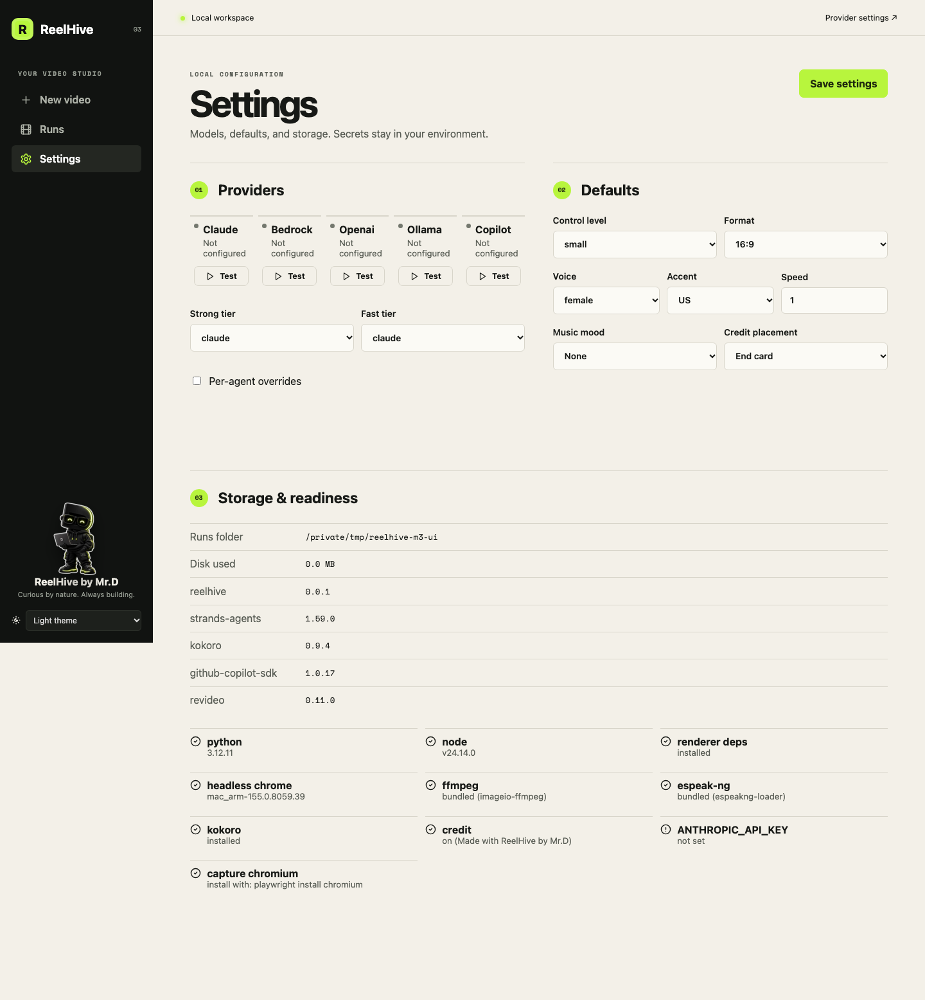

# ReelHive UI user guide

The ReelHive studio is a local web interface for turning a brief into a narrated video. It covers the full workflow: brief setup, visual sourcing, script review, scene direction, production monitoring, downloads, and recovery. The browser is the control surface; the workflow, voice preparation, video creation, and run files are managed on your computer. Configured AI services receive the content needed for their tasks.

## 1. Install and open the studio

ReelHive requires Python 3.11 or 3.12, Node 20+, and `uv`. From the repository root:

```bash
make setup
npm run build -w ui
export ANTHROPIC_API_KEY=...   # or configure another provider
uv run reelhive doctor
uv run reelhive ui
```

`reelhive ui` prints a URL, opens it in your default browser, and listens only on `127.0.0.1`. The URL contains a new launch token. ReelHive moves that token into browser session storage and removes it from the address bar after the first page loads.

Useful launch options:

```bash
uv run reelhive ui --port 8765
uv run reelhive ui --no-open
uv run reelhive ui --runs-dir ~/Videos/reelhive
uv run reelhive ui --config config.yaml
```

Keep the terminal open while using the studio. Press **Ctrl+C** there to stop it. A new launch creates a new token, so reopen the newly printed URL instead of reusing an old tab.

## Help as you work

Mr.D’s guide explains what is happening and what to do next. During production it follows actual stage events, including parallel work, review pauses, failures, and completion.

The small **?** icons explain unfamiliar controls and the consequences of actions. Hover or focus one to read it; click or tap to keep it open. Click again, press Escape, or click elsewhere to dismiss it. Only one hint opens at a time. Help beside a disabled action remains available.



## 2. Create a video brief

Choose **New video** in the sidebar. The first screen collects the content, format, voice, visual direction, and amount of review you want.



The main controls are:

1. **Customization level** decides how much you direct and how much the agents decide.

   | Level | You decide | The agents decide | Review points |
   | --- | --- | --- | --- |
   | **Low** | The brief | Research, story, wording, scenes, visuals, music | None: brief in, video out |
   | **Medium** | The brief and the script | Scenes, visuals, music | Script approval |
   | **High** | The brief, the script and every scene | Only what you leave open | Script, scenes and resolved images |

2. **Who is this for?** describes the audience. Rough is fine; concrete is better: "Platform engineers managing multi-account AWS" helps more than "developers."
3. **What's the story?** says what viewers should understand. Notes are enough ("what Scancomb is, what it offers, why it exists"); the agents turn them into a story.
4. **Product website** (optional) is researched before writing: the agents read up to ten pages for facts and correctly spelled names, and screenshots are taken from it unless you choose other visuals. Its text goes to your AI provider (it stays local with Ollama).
5. **Key points** are rough notes, one per row, up to eight. The agents decide how to tell them (merging, splitting or reordering) and write their own wording; the quality review only checks that each note is told somewhere.
6. **Closing idea** is what viewers should do at the end. Rough is fine: the agents polish it into a finished call to action and fix typos.
7. **Duration** accepts 15–180 seconds. More features need more time; a useful starting point is 30 seconds for one or two points and 60 seconds for three or four.
8. **Format** controls the render dimensions: landscape `16:9`, portrait `9:16`, or square `1:1`.
9. **Voice** selects gender, US/UK accent, and speed from 0.8 to 1.2. **Preview voice** speaks a fixed sample locally with Kokoro.

Medium and High add tone, pacing, brand colors, a logo, theme, CTA URL, music mood, and music level. High also lets you choose an exact music track. The frame on the right previews the brand palette, duration, voice and estimated scene count; the actual headlines are written by the agents.

The draft is saved in this browser as you type. **Clear form** (top of the page) starts a new brief from your saved defaults. **Import brief file** (top of the page) loads a YAML brief; **Export brief file** (bottom of the last step, next to the final button) downloads the completed form so it can be reviewed, versioned, or used with the CLI. Importing validates the same schema used by production.

## 3. Choose visual sources

For Medium or High, choose **Continue to visuals** after the brief is valid. ReelHive supports typography-only scenes, captures from a product, supplied images, generated concept art, or automatic selection.



| Visual source | What ReelHive does |
| --- | --- |
| **none** | Uses text and motion only |
| **auto** | Uses the product website for captures and tries suitable supplied images, then concept generation when enabled, then falls back to text |
| **screenshots** | Captures the configured application routes with Playwright |
| **images** | Uses uploaded images or a local image directory |
| **generate** | Generates concept art with the configured OpenAI image model |

### Capture an application

1. **Auto** uses your **Product website** for screenshots automatically. Choose **Use another app URL** only when you want to show a separate app, such as a signed-in dashboard. Without a product website, enter an **App URL** if you want captures. The address must be reachable from this computer. In **screenshots** mode, leaving **App URL** blank also uses your product website.
2. Add one route per line. Leave the list empty to let ReelHive discover up to ten same-origin pages.
3. Add sensitive elements under **Mask selectors**, one CSS selector per line. Matching elements are blacked out before capture.
4. Choose a browser, phone, or frameless presentation.
5. Use **Test capture** and inspect every preview before starting production.

For an authenticated app, choose **Sign in to your app**, complete the login in the opened browser, then choose **I finished signing in**. ReelHive saves browser cookies and storage inside the private run folder. It does not receive the password. Keep the saved login state out of source control.

### Use supplied images

Select **images** or **auto**, write a useful caption, then drop PNG, JPEG, or WebP files into the upload area. Each file can be up to 10 MB and 30 megapixels. ReelHive re-encodes uploads and stores them inside the run.

You can also point at a local directory. A `captions.yaml` file in that directory can map filenames to descriptions. **Let AI describe my images** sends those image pixels to the selected scenes provider; leave it off to keep supplied-image pixels local.

### Generate concept images

Image generation requires the OpenAI integration, `OPENAI_API_KEY`, and an `image_generation.model` in `config.yaml`. Set a consistent style and a maximum image count. ReelHive generates only concept scenes; it never substitutes generated artwork for product UI.

When the setup is ready, choose **Write my script**. The page changes to the run view immediately while work continues in the background.

## 4. Review the script

Medium and High runs pause at **Awaiting Script**. Each beat shows its role, linked feature, narration, word count, and estimated speaking time.

- Edit narration directly when only wording needs to change.
- Use the regeneration note for a broader instruction such as “Open with the cost of the problem” or “Use less jargon.”
- Choose **Regenerate** to ask the script agent for another version.
- Choose **Approve and continue** to save the visible script and start scene planning, visuals, narration, music, and timing.

Approval uses the provider configuration saved with the run. Completed work is checkpointed, so an approval or resume does not start the whole production again.

## 5. Direct scenes in High mode

High runs pause again at **Awaiting Scenes**. This is the main creative-control workspace.



The proportional timeline at the top shows every scene, its template, duration, and image-approval state. Select a scene to edit it.

- **Template** changes the composition. Available layouts include hook, problem, feature card, stat, bullets, full image, screenshot pan, and CTA.
- **Duration override** pins a scene to a specific length. Leave it empty to let ReelHive fit timing around the narration and target duration.
- **Headline** and **Supporting text** control the words shown on screen. Template-specific length limits are enforced.
- **Narration** changes the spoken text. Saving a change re-synthesizes only the affected audio.
- **Override voice** lets one scene use another gender, accent, or speed.
- **Visual kind** tells the resolver whether the scene needs product UI, concept art, or no image. Use **Image or route** for a page route (product UI) or a description (concept). Changing the kind clears the previous request and image approval.
- **Approve this image** appears when a visual has resolved. Every resolved image must be approved before rendering.
- **Live preview** uses the same Revideo project as the final render. Play it to check layout, timing, and the selected visual.

Choose **Save scenes** after direct edits or image approvals. Rendering, regeneration, and suggested edits remain disabled while scenes have unsaved changes. **Regenerate scene** reruns only the selected scene using the regeneration note. Review the result again because regeneration can change narration, text, or the requested visual.

When every resolved image is approved, **Approve all and render** becomes available. This continues through the critic, any repair pass, and the final renderer.

## 6. Follow production and quality checks

During production, the run page shows five stages: **Story**, **Create**, **Timing**, **Review**, and **Video**. Research comes before writing; scene design, narration, and music can work in parallel; visuals follow scene design. Timing joins their results, then quality review can request repairs before video creation. Each task shows its real state and elapsed time when available. The connection badge shows whether live server-sent events are connected; temporary disconnects replay missed events after reconnection.



Long story briefs use a compact heading. Choose **Read full story brief** to expand the original text.

The **Quality checks** section records deterministic checks and the critic verdict, including duration, pace, required feature coverage, closing-message presence, text limits, and visual constraints. If the critic requests a fix, the Review stage shows repairs and final checks. Failed checks show “Needs attention”; their technical details remain in **Download run log**.

Only one production job renders at a time. Additional approved jobs show **Queued** with their position. **Cancel at next node** requests a clean stop at the next checkpoint rather than terminating a file write midway.

If the app or computer closes during a run, ReelHive marks unfinished work as **Interrupted** on the next launch. Open the run and choose **Resume from checkpoint**. Failed and cancelled runs expose the same recovery action and show their report when one is available.

When the status reaches **Done**, the final section provides:

- an inline video player;
- **Download MP4** for the finished video;
- **Download all files (.zip)**: everything the production made (brief, product research, script, scene plan, audio, video and run log), to archive, re-run from the CLI, or share for troubleshooting;
- **Reveal folder** to open the local run directory.

## 7. Manage the run library

Choose **Runs** to search and filter every production in the selected runs folder.



Click a row to open the production. The action buttons on the right let you:

- download the MP4 when a video exists;
- duplicate the run’s brief into **New video**;
- reveal its folder in Finder or the platform file manager;
- delete the run after confirmation.

An active run must be cancelled and allowed to stop before it can be deleted. Duplicating copies the brief values; check any referenced local folders, URLs, or credentials before starting the new run.

Common statuses:

| Status | Meaning |
| --- | --- |
| **Drafting** | The script agent is working |
| **Awaiting Script** | The script needs review |
| **Queued** | The run is waiting for the production slot |
| **Producing** | Scene, audio, visual, quality, or render work is active |
| **Awaiting Scenes** | A High run needs scene and image approval |
| **Done** | The MP4 is ready |
| **Stopped** | Production paused with a reviewable spec or quality report |
| **Failed** | A provider, dependency, validation, or render step failed |
| **Cancelled** | A cancellation completed at a checkpoint |
| **Interrupted** | The previous UI process ended during work |

## 8. Configure providers and defaults

Choose **Settings** to manage non-secret configuration and inspect local readiness.



The **Providers** panel shows available integrations. **Test** sends a minimal live request, so it verifies authentication and model access and may incur a small provider charge. Strong-tier agents write and critique the script; fast-tier agents plan scenes and choose music. Enable **Per-agent overrides** when a specific node should use another provider.

Provider secrets are never accepted in the UI or saved to `config.yaml`. Set them in the environment before launch:

```bash
export ANTHROPIC_API_KEY=...
export OPENAI_API_KEY=...
export GH_TOKEN=...                  # or COPILOT_GITHUB_TOKEN
export AWS_PROFILE=...               # standard AWS credentials also work
```

For Ollama, start the local server and configure its model names and `ollama_host` in `config.yaml`. Model IDs for providers other than the built-in Claude defaults also belong in that file. See [Providers](providers.md) for complete examples.

The **Defaults** panel sets the initial control level, format, voice, music mood, and credit placement for new briefs. **Storage & readiness** shows the active runs folder, disk use, plain-language readiness checks for voice, video creation, capture, credentials, and credit. A runs-folder change in `config.yaml` or `--runs-dir` takes effect when the studio is launched again.

The appearance selector at the bottom of the sidebar supports system, light, and dark themes. The UI also provides a skip link, semantic labels, visible focus states, and keyboard-accessible controls.

## 9. Privacy and local security

- The server binds only to `127.0.0.1` and checks the launch token, Host header, and write-request Origin.
- Brief text, scripts, filenames, captions, page titles, and headings go to the configured agent provider. Ollama keeps agent requests local.
- Screenshot pixels stay local. Supplied-image pixels stay local unless **Let AI describe my images** is enabled.
- Concept prompts and brand style go to OpenAI only when generation is enabled.
- Voice synthesis, audio mixing, rendering, videos, cookies, and run logs stay on this computer.
- Uploaded and downloaded paths are restricted to the selected run, and uploads are size-checked and re-encoded.

The launch token protects this local session; it is not an account password. Do not expose the loopback server through a proxy or tunnel.

## 10. Troubleshooting

**The page says “Build the UI first.”**

```bash
npm run build -w ui
uv run reelhive ui
```

**The header says “Connecting to workspace.”** Reopen the complete URL printed by the current `reelhive ui` process. Tokens from earlier launches no longer work.

**A provider says “Test connection.”** Set its environment credentials before launching ReelHive, install its optional dependency if required, and run `uv run reelhive doctor --config config.yaml`. Then restart the UI and use **Test**.

**Image generation is disabled.** Install the OpenAI extra, set `OPENAI_API_KEY`, configure `image_generation.model`, and restart the studio.

**A capture is blank or missing pages.** Confirm the app URL is reachable, provide routes explicitly, finish sign-in when required, and use **Test capture**. Cross-origin navigation is rejected. See [Visuals](visuals.md) for capture sizing and fallback rules.

**Approve all and render is disabled (High only).** Select every timeline scene that has an image and enable **Approve this image**, then save the scenes. Unsaved scene changes also disable rendering. Scenes without a resolved visual do not need image approval. Low and Medium never require individual image approval, including during recovery: save any corrections and choose **Continue production**.

**A run is stuck after the UI closed.** Launch the studio again, open the run marked **Interrupted**, and choose **Resume from checkpoint**.

**The finished video differs from the preview.** Confirm that the scene was saved before approval. The preview shows the selected scene; the final render also includes transitions, the full timeline, mixed music, narration, and the ReelHive credit.

For field-level brief details, see the [Brief reference](brief-reference.md). For source resolution, login state, masking, and image-generation rules, see [Visuals](visuals.md).
